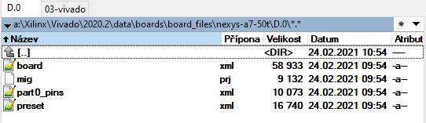

# How to add Nexys A7-50T to Vivado 2020.2

Nexys A7-50T might not be part of the Vivado 2020.2 Installation but it can be added manually, see [0] for details.

Adding process

1. Download [nexys-a7-50t/D.0](https://github.com/Digilent/vivado-boards/tree/master/new/board_files/nexys-a7-50t/D.0) board files, using for example http://kinolien.github.io/gitzip/

2. In the Vivavo installation folder create following folder

   ```
   ...Xilinx\Vivado\2020.2\data\boards\board_files\nexys-a7-50t\D.0\
   ```

3. Paste the content of downloaded D.0 folder to the created folder.

4. Restart Vivado.




###### Sources

[0]: https://forums.xilinx.com/t5/Vivado-Debug-and-Power/help-find-board-files-for-Nexys-a7-in-Vivado/td-p/1166486

